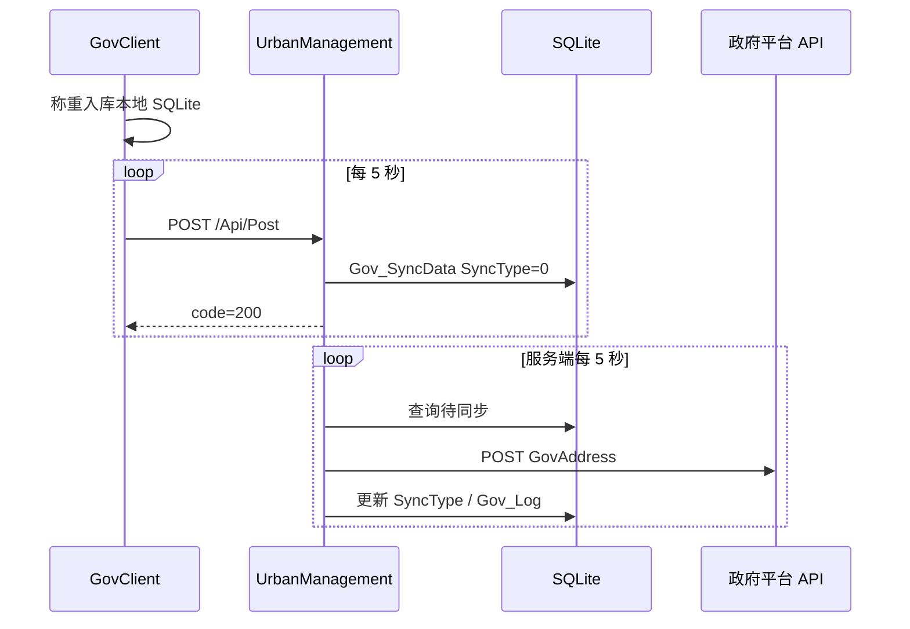

# 06 - 旧客户端对接实施指南

> **文档性质**：实施说明（非代码变更）。UrbanManagement 仓库中的 Legacy API **尚未实现**；按本文在目标仓库编码与联调。

## 1. 目标与边界

| 项 | 说明 |
|----|------|
| **旧客户端** | `Fdsoft.Weight.GovClient`（WinForms，.NET Framework），**不修改** |
| **新服务端** | `repos/UrbanManagement`（ABP 10 + EF Core SQLite） |
| **替代对象** | `FdSoft.MaterialSys.Gov.XiaoShanServe` |
| **核心契约** | `POST /Api/Post`，JSON camelCase，响应含 `success` / `msg` / `code` |

旧客户端**不能**改用 `POST /api/urban/weighing-records`；该端点仅面向 MaterialClient 架构的新客户端。

## 2. 端到端链路



**GovClient 侧**（详见 `docs/2026-05-12-govclient-weight-to-xiaoshanserve/03-GovClient数据上报链路.md`）：

- 萧山模式：`networkCompany = 萧山1` → `MsgAction = "post"` → 实际 URL 为 `{govXiaoShan基地址}post`，即 **`/Api/Post`**
- 成功条件：反序列化响应后 **`code == 200`**
- 请求体：`mGovRequestWeight`（`carNo`、`snapImages` Base64 数组、`buildLicenseNo` / `fdBuildLicenseNo` 等）

**原服务端逻辑**（源码：`XiaoShanServe/Controllers/ApiController.cs`）：

1. 接入码二选一验证（凡东码 / 城管码）
2. `snapImages` → 本地 `FilesPhysicalPath/TempUpload/{buildLicenseNo}/`
3. 大于 `CompressImage` KB 则 JPEG 压缩（质量约 60）
4. 写入 `Gov_SyncData`，`SyncType = 0`，`SyncNumber = 0`
5. `sourceData` 保留原始 JSON（`snapImages` 字段清空）

**转发**（源码：`Service/ExplortStatisticBgService.cs`）：

- 每 5 秒；仅 `Gov_Project.SyncStatus == true` 且已配置 `BuildLicenseNo` 的项目
- 条件：`SyncType != 成功` 且 `SyncNumber < 5`
- POST 到 `appsettings.json` → `GovAddress`（默认 `http://191.12.15.58:8899/sapi/v1/inoutRecord/save`）

## 3. UrbanManagement 待实现组件

在 **UrbanManagement** 仓库（非本 vault）中实现，建议落在 `UrbanManagement.Core` + `UrbanManagement.App`。

| 组件 | 项目 | 职责 |
|------|------|------|
| `LegacyApiController` | App | 路由 `[Route("Api/[action]")]`，`Post([FromBody] JsonElement)` |
| `ILegacyGovSyncAppService` | Core | 编排：验码 → 存图 → 写 `GovSyncData` |
| `IGovProjectManager` | Core | `ValidateAccessCodeAsync`，错误文案与 XiaoShanServe 一致 |
| `ILegacyFileService` | Core | Base64 → 本地路径，路径格式 `//TempUpload//{buildLicenseNo}\{ticks}_{i}.jpg` |
| `GovSyncBackgroundService` | Core/App | `BackgroundService`，5 秒轮询，HTTP 转发政府 API |
| `StorageOptions` | Core | 绑定 `FilesPhysicalPath`、`CompressImage`、`GovAddress` |

### 3.1 配置项（与 XiaoShanServe 对齐）

在 `appsettings.json` 增加：

```json
{
  "FilesPhysicalPath": "Uploads/",
  "CompressImage": "200",
  "GovAddress": "http://191.12.15.58:8899/sapi/v1/inoutRecord/save"
}
```

生产环境 `FilesPhysicalPath` 需与旧机一致或做数据迁移，否则后台转发读图失败。

### 3.2 接入码验证规则

与 `ApiController.Post` 保持一致：

| 步骤 | 条件 | 行为 |
|------|------|------|
| 1 | `buildLicenseNo` 与 `fdBuildLicenseNo` 均为空 | 拒收：`数据没有接入码，请检查填写是否正确` |
| 2 | `fdBuildLicenseNo` 非空 | 查 `Gov_Project.FdBuildLicenseNo`；失败：`对接码[{fdBuildLicenseNo}]未接入...`；成功：用库内 `BuildLicenseNo` 覆盖请求 |
| 3 | `buildLicenseNo` 非空 | 查 `Gov_Project.BuildLicenseNo`；失败：`对接码[{buildLicenseNo}]未接入...` |

`GovProject` 主键为 **Guid**；`GovSyncData.ProId` 建议存 `project.Id.ToString()`（旧库为 int 时需迁移映射，见 `03-数据模型映射与迁移.md`）。

### 3.3 响应格式（必须）

```json
{
  "success": true,
  "msg": "成功",
  "code": 200,
  "data": null
}
```

失败时 `code: -1`。新 API `UrbanWeighingRecordController` 当前**无 `code` 字段**，旧客户端会判为失败。

### 3.4 JSON 序列化

`UrbanManagementAppModule` 已配置 camelCase。建议补充：

- 入参：优先 `JsonElement` / `GovRequestWeightDto` + `[JsonPropertyName("carNo")]` 等，避免 ModelState 拒绝未知字段
- 日期：旧客户端 `snapTime` 多为 `yyyy-MM-dd HH:mm:ss`，可增加自定义 `JsonConverter`

### 3.5 实体与表（已实现，直接复用）

| 实体 | 表名 | 用途 |
|------|------|------|
| `GovProject` | `Gov_Project` | 接入码、同步开关 |
| `GovSyncData` | `Gov_SyncData` | 待转发载荷（主键 `int`） |
| `GovLog` | `Gov_Log` | 转发日志 |

建议在 `UrbanManagementDbContext` 为 `BuildLicenseNo`、`FdBuildLicenseNo` 建索引。

## 4. 运维：仅改 GovClient 指向

旧客户端**无需发版**时：

1. 将配置中的萧山 API 基地址改为 UrbanManagement 部署地址（协议、端口、路径前缀与旧环境一致）
2. 确认 `POST {基地址}/Api/Post` 可达（防火墙、HTTPS 证书）
3. 在 UrbanManagement 库中预先导入 `Gov_Project`（对接码与旧 SQLite 一致）

GovClient 仍通过 Telnet/连通性控制 `GovApiOnline`；服务不可达时不会上报。

## 5. 实施顺序与验收

| 阶段 | 内容 | 验收 |
|------|------|------|
| P0-1 | `LegacyApiController` + `IGovProjectManager` + `GovSyncData` 入库 | Postman 模拟旧 JSON，`code=200` |
| P0-2 | `ILegacyFileService` + 配置项 | DB 中 `SnapImages` 有 `//TempUpload//...` 路径且文件存在 |
| P0-3 | `GovSyncBackgroundService` + `GovLog` | 待同步记录 `SyncType` 变为 1，政府侧可查 |
| P1 | `ProjectController` / `SyncInfoController` 接真实 Repository | 管理端可见真实数据 |
| 联调 | 旧 GovClient 并行 48h | 与 XiaoShanServe 同期数据抽样一致 |

契约测试 JSON 样例见 [04-API兼容性方案.md](./04-API兼容性方案.md) §6.1。

## 6. 风险与依赖

| 风险 | 缓解 |
|------|------|
| `Gov_Project` 无数据导致全部拒收 | 自旧库迁移或管理端录入 |
| 图片路径不一致 | 统一 `FilesPhysicalPath`，转发前 `File.Exists` 校验 |
| `GovAddress` 不可达 | 配置化 URL；Polly 重试（可选） |
| 政府 API 字段与萧山组装逻辑不一致 | 转发体继续沿用 `ExplortStatisticBgService` 中 `mGovRequestWeight` 组装规则 |

## 7. 相关文档

| 文档 | 说明 |
|------|------|
| [04-API兼容性方案.md](./04-API兼容性方案.md) | 兼容层设计草图、DTO、测试用例 |
| [05-核心功能迁移清单.md](./05-核心功能迁移清单.md) | P0/P1 人天与里程碑 |
| [01-源系统架构分析.md](./01-源系统架构分析.md) | `ApiController` 字段级说明 |
| `docs/2026-05-12-govclient-weight-to-xiaoshanserve/` | 客户端上报链路 |

---

**状态**：截至文档更新日，UrbanManagement **未包含** `LegacyApiController`；实施请在 `repos/UrbanManagement` 仓库按本文执行，勿与本 CodeRef vault 混淆。
